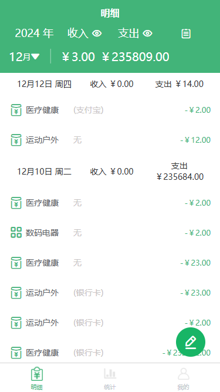
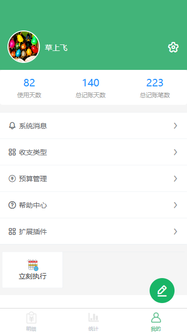
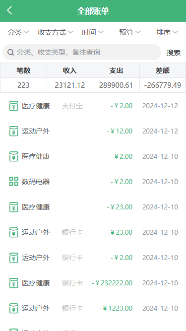
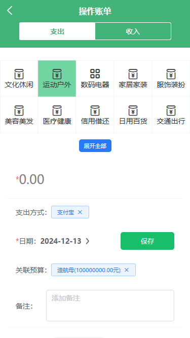
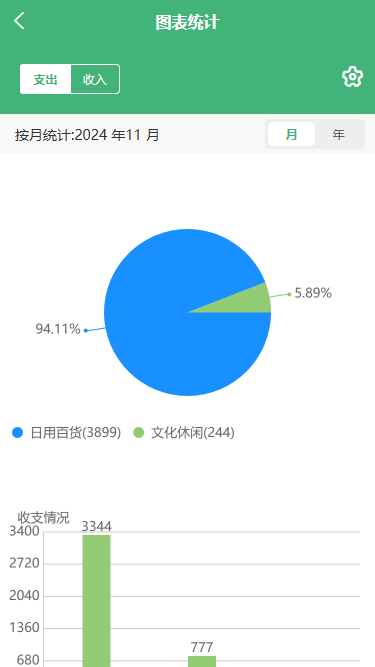
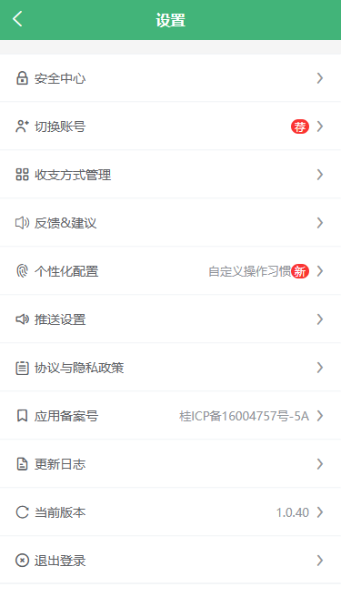

## BS记账

### 简介
记账APP后台，uniapp（vue2）+ thinkphp6开发,管理后台用element ui

系统是之前开发自用的，本着够用就行，难免有bug，如有疑问，或者需要定制开发欢迎交流，微信号：woyekeyiha。

本项目是基于[https://ext.dcloud.net.cn/plugin?id=6553](https://ext.dcloud.net.cn/plugin?id=6553)魔改的，调整了样式，移除了一些不需要的功能。

我主要是编译成安卓端自用，其他端的兼容问题需要自己去调整。

### 和本项目配套的后台接口

### 使用说明
- const.js 里面配置你的后端接口和加密秘钥（具体看const.js.example文件）

### 系统展示

### 使用
#### 1.自己编译

克隆本项目：git clone https://gitee.com/brisklan/bs_account

1. 用Hbuilder打开运行
2. 选择自己的编译模式生成相关平台文件

#### 2.使用线上系统
1. 下载最新版APP(https://jz.alipay168.cn/#/pages/packageA/h5/index)，注册账号，登录
2.  使用微信小程序，搜索“极简随手记”即可使用最新版
 
3.  在网页使用浏览器打开：https://jz.alipay168.cn

### 赞助

### 赞助者
1.  [brisklan](https://gitee.com/brisklan)
